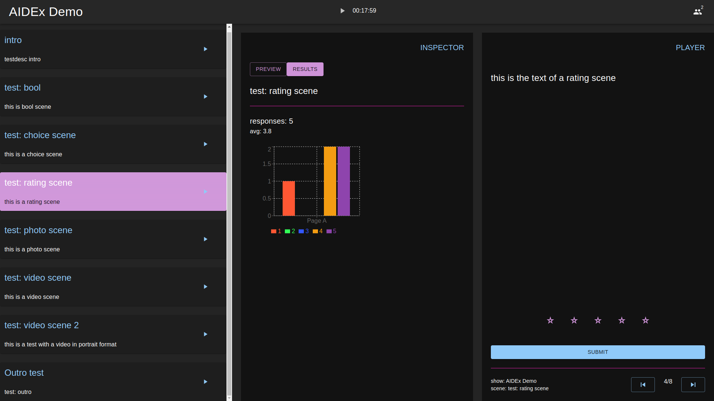

# inau - Interactive Audience (WIP)

**inau** is a system for interactive live performances. It consists of a web app for smartphone clients, a web app to control the show, and a CMS to configure a show and collect data for later analytics.

Please note, it is currently being refactored and is not usable.

## Scene Types
* **bool**: Yes/No kind of questions.
* **choice**: Multiple or single choice questions.
* **rating**: TODO.

## Features
* **real-time CMS updates**: content updates are immediately available in the control app, which is quite handy for the design and development phase
* **multiple shows**: one installation can host multiple shows in parallel

## Usage
### CMS
* **start cms**: `cd cms && docker-compose up`
* **apply db schema**: `docker exec -it inau sh`, `npx directus schema apply ./snapshots/current.yaml`
* **create a show**

### web app
* **set variables in .env**: `code app/.env`
* **start web app**: `cd app && npm run dev`
* **control interface**: shows/{ID}/control
* **client interface**: shows/{ID}/run

### screenshots

  
  

